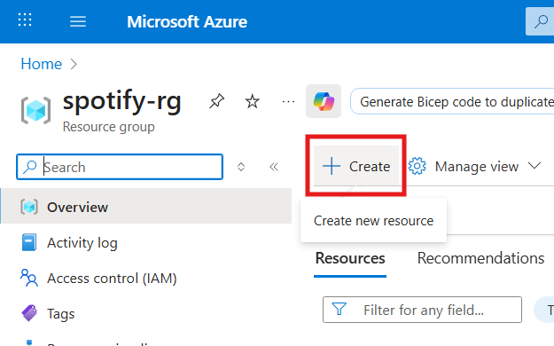
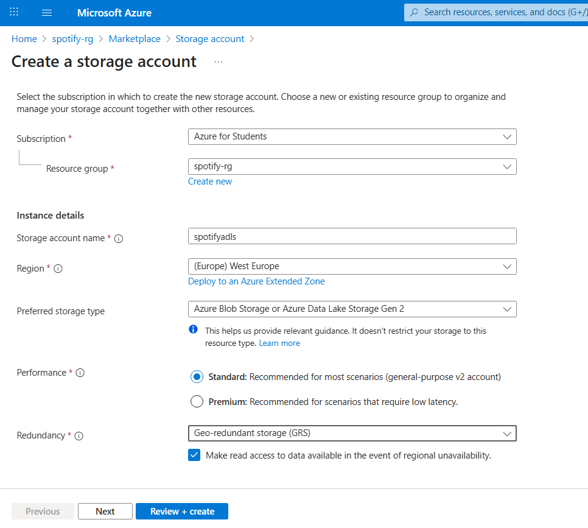
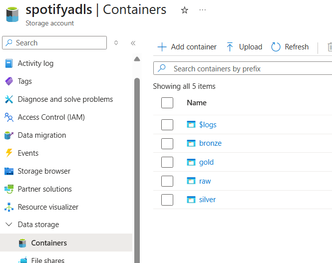

# Prerequisites
Before creating the resources, it is handy to create the `resource group` first for easier management. 

After the `resource group` is created, we can add resources into the group. 

# Spotify Dashboard 
In order to use Spotify API, we need to create a Spotify dashboard. Go to [Spotify Dashboard](https://developer.spotify.com/dashboard) and create one. 

The `Redirect URIs` are the ones that enable Spotify authentication service to automatically relaunch the app everytime the user logs in. 
> **TLDR**: user log in -> authorization -> get back to this *redirect URI*.   At this stage, there will be a function to handle in case user accepts or rejects the authorization.

# Azure Data Lake Storage Gen2
In the resource group, create `Storage account`. 

In `Advanced` tab, tick `Enable hierarchical namespace`. If you don't choose this opiton, you'll end up getting a **blob storage**.  
More info at [ADLS Gen2 Overview](https://www.youtube.com/watch?v=McJj_N-pjgI).

## Initial setup 
Initially, in this storage, we will create 4 containers (folders) for later use. These containers follow the **Medallion Architecture**. 
- **raw**: save the raw data 
- **bronze**: raw data + time_ingested
- **silver**: bronze + cleansing + validation etc ...
- **gold**: aggregated data, ready to be pushed to dashboards for analytics

# Azure Data Factory
In the resource group, create `Data Factory`.
